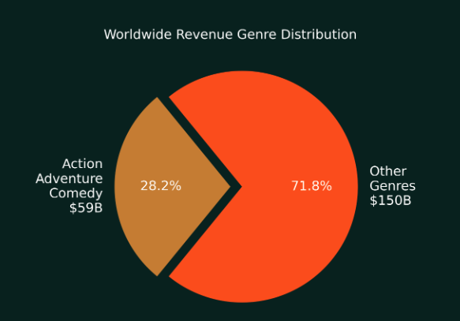
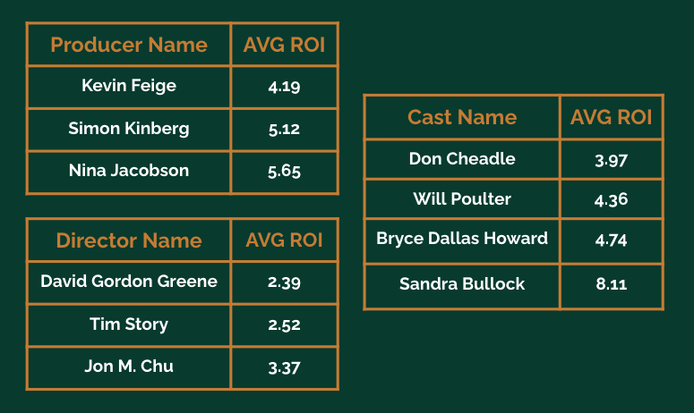
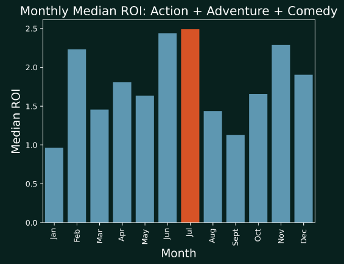

# Microsoft Enters Film Industry: Data Analysis and Recommendations

Team: Diego Fernandez, Rachael McCue, Parker DeShazo

[Presentation link]

## Navigating this repository
Folders: \
  zippedData\
      Includes all csvs, and zipped database \ 
  notebooks \ 
      Data exploration notebooks: initial_data_exploration, secondary_data_exploration\
      Master data set resides in: inflation_adjusted_to_budget_master_dataset \
      Data Analysis: boxplots_piechart_scatter_plots_gross_rev_and_ROI, talent_recommendations, determine_best_release_month_of_year \
  images \
  Slide Deck pdf

## Overview
Microsoft will be entering the film industry, and we were tasked with analzying some data sets to set them up for success on their first film. Using domain knowledge, and the datasets provided below, we drew insights about the movie industry, genres, creative talent, and release dates that have shown to be successful. 

Data is reviewed from:\
  IMDB database\
  The Numbers\
  The Movie Database
  

## Business Understanding
Microsoft, while a head honcho is many other facets, is the underdog in the film industry. They have the capital to produce a film, but perhaps not the experience. In order for Microsoft to insert themselves into the $209B industry, we studied what would be a successful safe-bet first movie. What genres are proven to be successful? What time of year should you release a film? Who should you hire to produce the film? 

We used total revenue to locate successful genres to tap into, as well as return on investmemt to see who to hire and when to release a film. 

## Data Understanding and Analysis

Our insights were retrieved by creating a master data set with the following parameters: a budget of at least $10 million to rule out the small or independent filmmakers, dropped any data that did not have a worldwide gross income datapoint, _____________. 

The master dataset inclues the following information:\
  Release Date\
  Movie Name \
  Production Budget\
  Inflation Adjusted Production Budget\
  Domestic Gross \
  Worldwide Gross\
  Worldwide Profit\
  ROI\
  Person Name\
  Movie Role \
  And boolean values for all of the genres:\
  Action, Adult, Adventure, Animation, Biography, Comedy, Crime, Documentary, Drama, Family, Fantasy, Game-Show, History, Horror Music, Musical, Mystery,   News, Reality-TV, RomanceSci-Fi, Short, Sport, Talk-Show, Thriller, War, Western
 
 This left us with 1091 movies from 2010-2020.
 
 While merging some individual datasets, we merged on Movie Name amd Release Date as keys so we knew we were referencing the correct movie. There were some duplicate movie names, such as Avatar. Did you know there is a Japanese horror film called Avatar? 
 
### Genre Recommendations

Based on worldwide gross, the following genres are bring in the most revenue: Action, Adventure and Comedy. These genres consume 28% of the market. These are a safe bet to invest in at the first time. 

### Talent Recommendations

We also found that particular creative talent is a driver for return on investment. We selected directors, producers, writers, actors and actresses. These people were all involved in at least 3 movies during the time of our dataset (2010-2020). In addition to pulling the data, we did some research to ensure these people were relevant in the industry. However, the ROI associated per individual is a guide. We used their median ROI, as mean would be skewed towards outliers. The entire charts can be located in the talent_recommendations ntoebook.

### Release Planning

Also using median ROI, we found the best time of year to release a movie. The data shows that July is optimal to release a movie, and secondarily around the holidays.

## Conclusion

While there are many factors to creating a great movie, we stuck to the finances to measure success and located the following insights to provide Microsoft on their first movie production. 

Lucrative genres include Action, Adventure, and Comedy. 

Your creative talent team will generate a high return on investment. 

The best time to release a film is in summer (specifically July), and secondarily during the holidays. 

